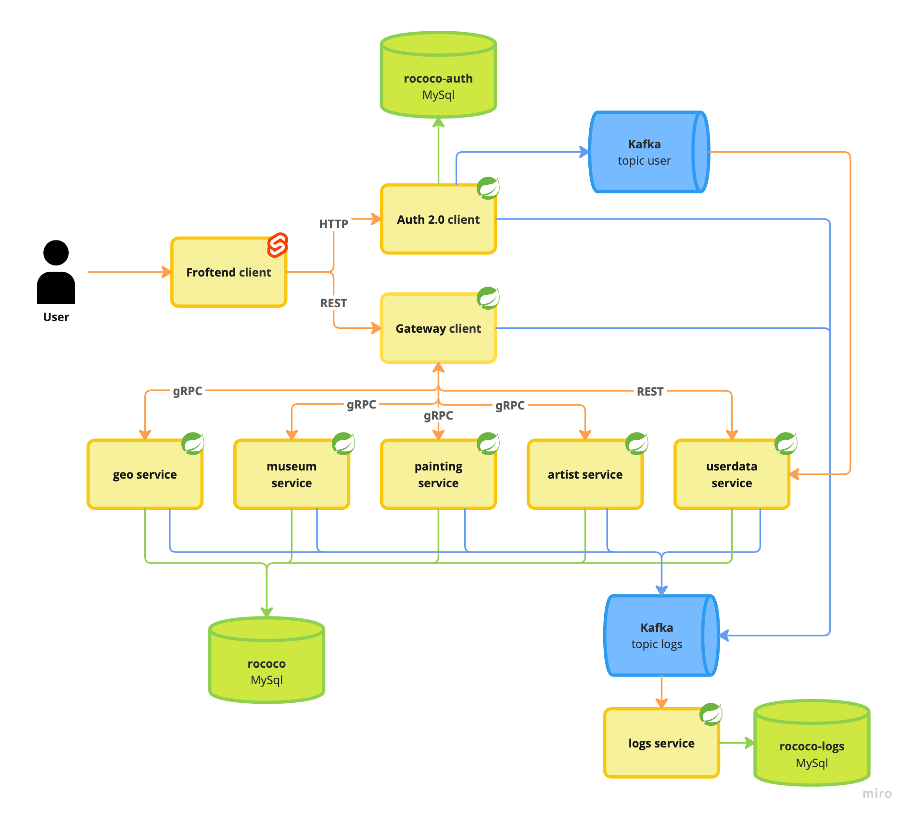

# Rococo

Проект для дипломной работы **QA.GURU Advanced**. Rococo использует классический REST на фронтенде и микросервисную архитектуру на Java.

## Технологии, использованные в Rococo

- [Spring Authorization Server](https://spring.io/projects/spring-authorization-server)
- [Spring OAuth 2.0 Resource Server](https://docs.spring.io/spring-security/reference/servlet/oauth2/resource-server/index.html)
- [Spring Web](https://docs.spring.io/spring-framework/docs/current/reference/html/web.html#spring-web)
- [Spring Data JPA](https://spring.io/projects/spring-data-jpa)
- [Spring actuator](https://docs.spring.io/spring-boot/docs/current/reference/html/actuator.html)
- [Spring gRPC by yidongnan](https://yidongnan.github.io/grpc-spring-boot-starter/en/server/getting-started.html)
- [Apache Kafka](https://developer.confluent.io/quickstart/kafka-docker/)
- [Docker](https://www.docker.com/resources/what-container/) и [Docker-compose](https://docs.docker.com/compose/)
- [MySQL](https://www.mysql.com/)
- [Svelte](https://svelte.dev/)
- [JUnit 5](https://junit.org/junit5/docs/current/user-guide/)
- [Retrofit 2](https://square.github.io/retrofit/)
- [Allure](https://docs.qameta.io/allure/)
- [Selenide](https://selenide.org/)
- [Selenoid & Selenoid‑UI](https://aerokube.com/selenoid/latest/)
- [Allure-docker-service](https://github.com/fescobar/allure-docker-service)
- [Java 21](https://adoptium.net/en-GB/temurin/releases/) & [Gradle 8.6](https://docs.gradle.org/8.6/release-notes.html)

Рекомендуемые материалы к просмотру (прочтению):

- [Implementing an OAuth 2 authorization server with Spring Security - the new way! by Laurentiu Spilca](https://youtu.be/DaUGKnA7aro)
- [Full Stack OAuth 2 - With Spring Security / React / Angular Part 1](https://youtu.be/SfNIjS_2H4M)
- [Full Stack OAuth 2 - With Spring Security / React / Angular Part 2](https://youtu.be/3bGer6-6mdY)
- [Spring Data? Да, та! by Евгений Борисов](https://youtu.be/nwM7A4TwU3M)
- [Spring – Глубоко и не очень by Евгений Борисов](https://youtu.be/nGfeSo52_8A)
- [Spring-потрошитель, часть 1 by Евгений Борисов](https://youtu.be/BmBr5diz8WA)
- [Spring-потрошитель, часть 2 by Евгений Борисов](https://youtu.be/cou_qomYLNU)
- [Spring-построитель by Евгений Борисов](https://youtu.be/rd6wxPzXQvo)
- [Перенимаем опыт Google в построении микросервисов с gRPC by Александр Борисов](https://youtu.be/zPbaKUIcFx0)

## Схема проекта Rococo



# Минимальные предусловия для работы с проектом

### 0. Если у вас ОС Windows

Используйте [bash terminal](https://www.geeksforgeeks.org/working-on-git-bash/) (gitbash, cygwin или WSL) вместо PowerShell. Добавьте его в качестве терминала в вашей IDE.

### 1. Установить docker (если не установлен)

[Установка на Windows](https://docs.docker.com/desktop/install/windows-install/)

[Установка на Mac](https://docs.docker.com/desktop/install/mac-install/) (для ARM и Intel разные пакеты)

[Установка на Linux](https://docs.docker.com/desktop/install/linux-install/)

После установки проверьте работу docker:

```posh
docker -v
```

### 2. Спуллить необходимые образы

```posh
docker pull mysql:8.0
docker pull apache/kafka:3.4.0
docker pull wiremock/wiremock:2.35.0
```

### 3. Создать volume для MySQL и Allure

```posh
docker volume create mysqldata
docker volume create allure-results
```

### 4. Запустить БД и Kafka

В корне проекта выполните:

```posh
bash localenv.sh
```

Скрипт остановит ранее запущенные контейнеры и поднимет MySQL и Kafka.

### 5. Запустить фронтенд

```posh
cd rococo-client
npm i
npm run dev
```

Фронтенд будет доступен на http://127.0.0.1:3000/

### 6. Запустить Wiremock

```posh
bash wiremock.sh
```

Wiremock стартует на порту 8080: http://127.0.0.1:8080/

Для имитации авторизации добавьте токен в `localStorage` браузера:

```javascript
localStorage.setItem('id_token', 'faketoken')
```

После обновления страницы вместо кнопки «Войти» отобразится профиль.

# Запуск в Docker

Перейдите в корень проекта и выполните:

```posh
bash docker-compose-dev.sh
```

Скрипт очистит старые контейнеры и образы, соберёт все сервисы и запустит их в docker compose.

Чтобы домены вида `*.rococo.dc` (например, `http://gateway.rococo.dc`) резолвились в `127.0.0.1`, добавьте их в hosts-файл.

#### macOS

Откройте `/etc/hosts` и добавьте строки:

```
127.0.0.1 gateway.rococo.dc
127.0.0.1 frontend.rococo.dc
127.0.0.1 auth.rococo.dc
127.0.0.1 artist.rococo.dc
127.0.0.1 geo.rococo.dc
127.0.0.1 museum.rococo.dc
127.0.0.1 painting.rococo.dc
127.0.0.1 userdata.rococo.dc
127.0.0.1 rococo-all-db
```

При необходимости выполните `sudo dscacheutil -flushcache`.

#### Windows

Откройте `C:\\Windows\\System32\\drivers\\etc\\hosts` от имени администратора и добавьте те же строки. После сохранения выполните `ipconfig /flushdns`.

Фронтенд будет доступен по адресу http://frontend.rococo.dc, Swagger сервиса gateway – http://gateway.rococo.dc:8090/swagger-ui/index.html.

# Создание своего Docker repository для форка Rococo и сборка своих контейнеров

1. Создайте публичные репозитории на https://hub.docker.com/ для сервисов:
   - rococo-client
   - rococo-auth
   - rococo-artist
   - rococo-gateway
   - rococo-geo
   - rococo-museum
   - rococo-painting
   - rococo-userdata
   - rococo-grpc
   - rococo-autotest
2. В файле `docker.properties` замените `IMAGE_PREFIX=timofeqa` на `IMAGE_PREFIX=<ваш_dockerhub_username>`.
3. В `build.gradle` замените `dockerHubName = "timofeqa"` на `dockerHubName = "<ваш_dockerhub_username>"`.
4. Соберите, запушьте и запустите проект:

```posh
bash docker-compose-dev.sh push
```

# Запуск e-2-e тестов в Docker network

В корне проекта выполните:

```posh
bash docker-compose-e2e.sh
```

Для пересборки и запуска только тестов без пересборки окружения используйте:

```posh
bash docker-compose-e2e.sh test-only
```

Добавьте `firefox` вторым аргументом, чтобы запустить тесты в Firefox.

Selenoid UI доступен по адресу: http://localhost:9091/

Allure UI доступен по адресу: http://localhost:5252/

Allure report: http://localhost:5050/allure-docker-service/projects/rococo-ng/reports/latest/index.html

---
## :octopus: CI/CD Pipeline(GitHub Actions)


---


